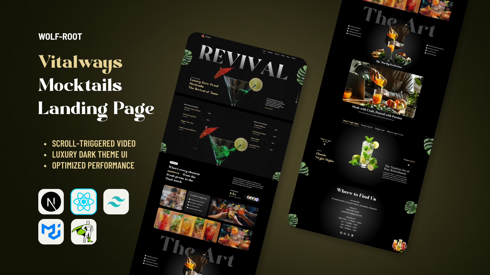

# VitalWays Mocktails

A captivating and responsive landing page designed for a high-end **mocktail bar or refreshing drinks brand**. This project showcases elegant UI/UX, built purely on the **FrontEnd** (no functionality), utilizing **Next.js**, **Tailwind CSS**, and **MUI (Material-UI)**, significantly enhanced with **GSAP ScrollTrigger and Animations** for a dynamic, visually engaging experience.

### Preview



[](https://opensource.org/licenses/MIT)


[Live Demo](https://Vitalways.vercel.app)

---

## Table of Contents

- [VitalWays Mocktails](#vitalways-mocktails)
  - [Preview](#preview)
  - [Table of Contents](#table-of-contents)
  - [About](#about)
  - [Features](#features)
  - [Tech Stack](#tech-stack)
  - [Installation](#installation)
  - [Contributing](#contributing)
  - [License](#license)

---

## About

This project is an elegant, high-performance **landing page for a modern beverage concept**. The primary goal was to create an immersive visual experience that highlights the **craftsmanship and quality** of non-alcoholic drinks (mocktails).

It serves as a demonstration of advanced frontend techniques, particularly:

- **Complex GSAP ScrollTrigger animations** for sections like the ingredients reveal.
- **Perfect responsive design** tailored for modern devices.
- **Seamless integration** between **Tailwind CSS** utilities and **MUI** components.

The project is **FrontEnd only** and focuses purely on the presentation layer.

---

## Features

- **Immersive GSAP Animations:** Utilizes ScrollTrigger for smooth, time-based animations (like the text and image reveals discussed previously) and general UI polish.
- **Beverage-Centric Design:** Focuses on visually appealing presentation of drinks, ingredients, and customer reviews.
- **Responsive Design:** Ensures a flawless viewing experience across desktop, tablet, and mobile screens.
- **MUI Integration:** Leverages Material-UI components (Grid, Card, Typography) for structured, consistent design.
- **Utility-First Styling:** Built primarily with Tailwind CSS for rapid and customizable layout implementation.
- **FrontEnd Only:** Focused exclusively on modern user interface and layout.

---

## Tech Stack

- **Next.js** – React framework for server-side rendering and static site generation
- **React** – Core JavaScript library for building the UI components
- **Tailwind CSS** – Utility-first CSS framework for efficient and flexible styling
- **MUI (Material-UI)** – High-quality React components for a modern look
- **GSAP (GreenSock)** – Advanced JavaScript library for high-performance animations (including ScrollTrigger)
- **JavaScript / TypeScript** – Core programming languages used

---

## Installation

1. Clone the repository:

```bash
git clone https://github.com/Wolf-Root/vitalways.git
```

2. Install dependencies:

```bash
npm install
```

3. Run the development server:

```bash
npm run dev
```

Open http://localhost:3000 in your browser to view the project.

---

## Contributing

1. Fork the repository
2. Create a feature branch:

```bash
git checkout -b feature/AmazingFeature
```

3. Commit your changes:

```bash
git commit -m "Add some AmazingFeature"
```

4. Push to your branch:

```bash
git push origin feature/AmazingFeature
```

5. Open a Pull Request

---

## License

This project is distributed under the MIT License. See LICENSE for more information.
